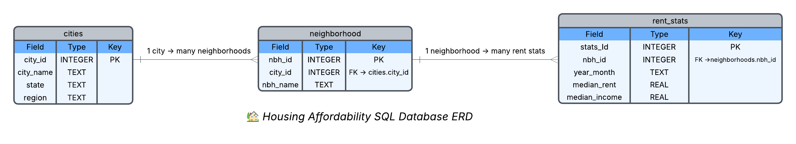

# 🏙️ Housing Affordability SQL Project

## 📘 Project Overview
This project explores **housing affordability and rent burden** using structured SQL analysis.  
I designed and populated a small SQLite database to study how monthly rent compares to household income across multiple cities and neighborhoods in the United States.

The project demonstrates beginner-level SQL skills, data modeling, and real-world data interpretation — all created in **SQLite** and managed through **VS Code**.

---

## 🎯 Objectives
- Understand how rent and income vary by city and neighborhood  
- Calculate **rent burden ratios** (rent as a percentage of income)  
- Identify areas considered **“cost-burdened”** (spending ≥ 30 % of income on rent)  
- Practice beginner-friendly SQL concepts such as:
  - `CREATE TABLE`, `INSERT`, `JOIN`
  - Aggregations (`GROUP BY`, `AVG`, `ROUND`)
  - Conditional logic (`CASE WHEN`)
  - Basic window functions (`ROW_NUMBER`, comparisons across months)

---

## 🧭 Entity Relationship Diagram (ERD)




---

## 💾 Sample Data
Each city contains several neighborhoods, and each neighborhood has rent and income data for two months (June 2025 & July 2025).  
Example rows:

| City | Neighborhood | Year-Month | Rent ($) | Income ($) |
|------|---------------|------------|-----------|------------|
| Norfolk | Ghent | 2025-06 | 1450 | 52000 |
| Boston | Dorchester | 2025-07 | 2325 | 78000 |

---

## 🔍 Example Analyses

### 1️⃣ Rent Burden by Neighborhood
```sql
SELECT
  c.city_name,
  n.nbh_name,
  r.year_month,
  r.median_rent,
  r.median_income,
  ROUND(r.median_rent / (r.median_income/12.0), 3) AS rent_burden_ratio
FROM rent_stats r
JOIN neighborhoods n ON r.nbh_id = n.nbh_id
JOIN cities c ON n.city_id = c.city_id
ORDER BY rent_burden_ratio DESC;

```


### 2️⃣ Flag Cost-Burdened Neighborhoods
```sql
SELECT
  c.city_name,
  n.nbh_name,
  r.year_month,
  ROUND(r.median_rent / (r.median_income/12.0), 3) AS rent_burden_ratio,
  CASE WHEN r.median_rent >= (r.median_income/12.0)*0.30
       THEN 'Cost-Burdened' ELSE 'OK' END AS status
FROM rent_stats r
JOIN neighborhoods n ON r.nbh_id = n.nbh_id
JOIN cities c ON n.city_id = c.city_id
ORDER BY status DESC;

```

### 3️⃣ Average Rent Burden by City
```sql
SELECT
  c.city_name,
  ROUND(AVG(r.median_rent / (r.median_income/12.0)), 3) AS avg_rent_burden
FROM rent_stats r
JOIN neighborhoods n ON r.nbh_id = n.nbh_id
JOIN cities c ON n.city_id = c.city_id
GROUP BY c.city_name
ORDER BY avg_rent_burden DESC;

```

### 4️⃣ Month-to-Month Rent Change
```sql
WITH ranked AS (
  SELECT
    r.*,
    ROW_NUMBER() OVER (PARTITION BY nbh_id ORDER BY year_month) AS rn
  FROM rent_stats r
)
SELECT
  c.city_name,
  n.nbh_name,
  cur.year_month,
  cur.median_rent AS rent_now,
  prev.median_rent AS rent_prev,
  ROUND((cur.median_rent - prev.median_rent), 2) AS change
FROM ranked cur
JOIN ranked prev ON cur.nbh_id = prev.nbh_id AND cur.rn = prev.rn + 1
JOIN neighborhoods n ON cur.nbh_id = n.nbh_id
JOIN cities c ON n.city_id = c.city_id
ORDER BY change DESC;

```
## 🪞 Reflection

Working on this project was an eye-opening experience that helped me connect the pieces between SQL concepts, database design, and real-world problem-solving. While creating the tables and relationships was straightforward, I found it challenging to **link everything together** correctly, especially when it came to understanding **how foreign keys connect data across multiple tables**. I had to spend time reviewing how `JOIN` statements work and how to properly structure data relationships so they produce meaningful results.

Another area that took practice was understanding **the logic behind each query**, not just writing SQL syntax, but really thinking through what each command was doing. For example, calculating rent burden ratios required converting annual income into monthly values, which taught me how SQL can handle mathematical expressions and derived columns.

I also learned how important it is to keep the database schema consistent and well-labeled. At first, I struggled with naming conventions and formatting, but once I switched to using **snake_case** and added clear primary/foreign keys, everything became more organized and readable.

Overall, this project helped me:
- Strengthen my understanding of SQL joins and relationships.
- Practice building a normalized database from scratch.
- Learn to troubleshoot small but important details — like making sure connections between tables actually work.
- Build confidence using **VS Code**, **SQLite**, and **GitHub** together in one workflow.

Going forward, I want to improve my ability to:
- Design more complex queries that combine multiple analytical functions.
- Automate data visualization by connecting SQL results to Power BI or Python.
- Document my process more clearly so others can follow my logic step-by-step.

